# Morrow Market — Full-Stack Marketplace

Morrow Market is a full-stack, multi-role e-commerce marketplace. An Angular client and a Spring microservice backend support the complete journey from product discovery and voucher-aware checkout to shop fulfillment, delivery, returns, reviews, account administration, and reporting.

[Backend repository](https://github.com/duynpce/ecommerce-BE) · [Frontend repository](https://github.com/duynpce/ecommerce-FE) · [Watch the video demo](https://www.youtube.com/watch?v=GtsnXQDmWhY)

[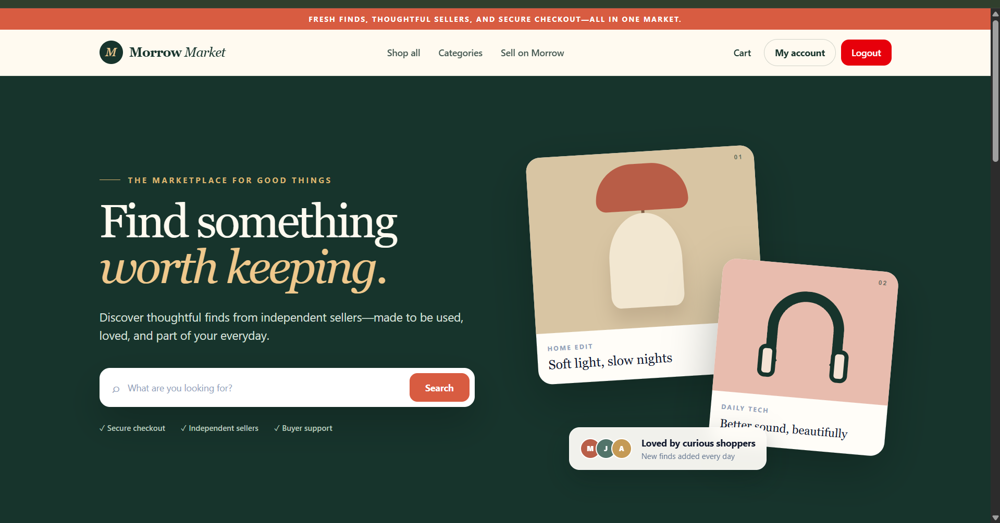](https://www.youtube.com/watch?v=GtsnXQDmWhY)

> Click the screenshot to watch the **Ecommerce** project demo on YouTube.

## Navigation

<p align="center">
  <a href="#project-demo"><strong>Project demo</strong></a> ·
  <a href="#architecture"><strong>Architecture</strong></a> ·
  <a href="#buying-procedure"><strong>Buying</strong></a> ·
  <a href="#delivery-procedure"><strong>Delivery</strong></a> ·
  <a href="#return-procedure"><strong>Return</strong></a> ·
  <a href="#getting-started"><strong>Run locally</strong></a>
</p>

| Visual navigator | Open at full resolution |
| --- | --- |
| Shopper demo | [Home](docs/screenshots/landing-page.png) · [Products](docs/screenshots/product-catalog.png) · [Cart](docs/screenshots/shopping-cart.png) · [Checkout](docs/screenshots/checkout-vouchers.png) · [Transactions](docs/screenshots/transaction-tracking.png) |
| Contributor demo | [Shops](docs/screenshots/contributor-shops.png) · [Orders](docs/screenshots/contributor-orders.png) |
| BPMN procedures | [Buying overview](docs/workflows/buying-procedure-overview.png) · [Sub-order confirmation](docs/workflows/sub-order-confirmation.png) · [Snapshot fulfillment](docs/workflows/snapshot-fulfillment.png) · [Delivery](docs/workflows/delivery-procedure.png) · [Return](docs/workflows/return-procedure.png) |

## Highlights

- Local and Keycloak-backed authentication with JWT access/refresh tokens and role-based permissions.
- Product, category, shop, inventory, rating, and review management.
- Cart and checkout flows with platform, shop, and shipping vouchers captured as transaction snapshots.
- Transaction and sub-order lifecycles with cancellation, rejection, delivery confirmation, and item returns.
- Camunda BPMN processes for buying, delivery, return, contributor promotion, and shipper application workflows.
- Dedicated shopper, contributor, shipper, and administrator capabilities.
- Account and product reporting with downloadable report support.

## User experiences

| Role | Capabilities |
| --- | --- |
| Shopper | Product and shop discovery, search and filters, cart selection, voucher-aware checkout, delivery details, transaction tracking, reviews, returns, profiles, and support tickets |
| Contributor | Shop and product management, inventory, sub-order fulfillment, returned-item handling, contributor profile, and shop voucher management |
| Shipper | Protected delivery workspace for accepting and completing delivery or return work |
| Administrator | Account roles/statuses, tickets, products, transactions, reports, and platform voucher management |

## Architecture

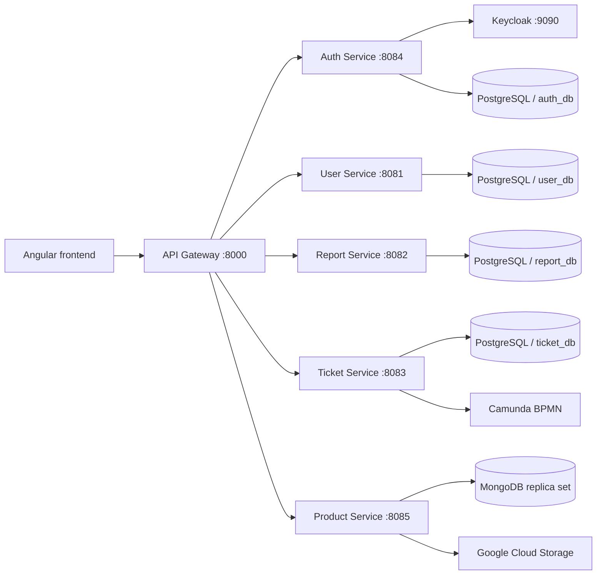

All browser traffic enters through the API gateway. Each service owns its data and exposes a focused domain API; synchronous service calls coordinate cross-domain workflows.

## Workflow navigator

<p align="center">
  <a href="#buying-procedure">🛒 <strong>Buying procedure</strong></a> →
  <a href="#delivery-procedure">🚚 <strong>Delivery procedure</strong></a> →
  <a href="#return-procedure">↩️ <strong>Return procedure</strong></a>
</p>

### Buying procedure

The purchase lifecycle is an executable Camunda model defined at `ticket-service/src/main/resources/bpmn/buying-items-procedure.bpmn` in the backend repository. It uses nested multi-instance subprocesses so independent shop orders and product snapshots can progress concurrently while still converging on one transaction result.

<details open>
<summary><strong>Buying procedure diagrams (3)</strong></summary>

#### Complete buying process

[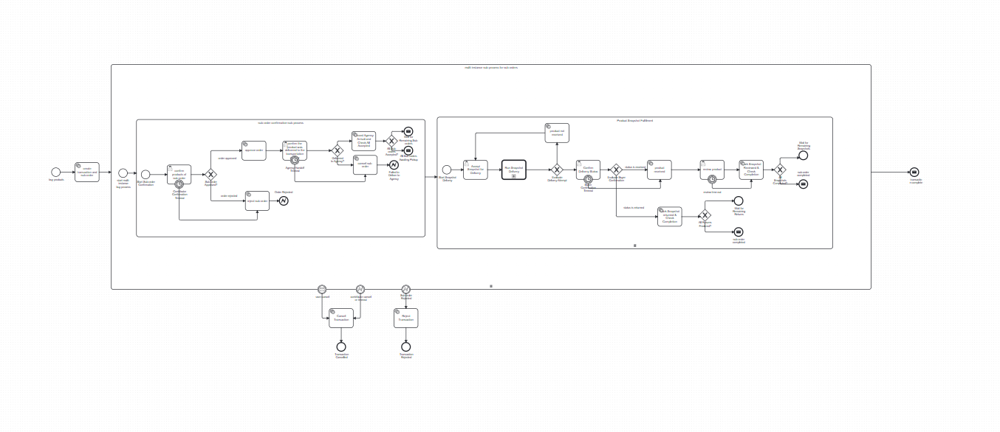](docs/workflows/buying-procedure-overview.png)

#### Sub-order confirmation and consolidation

[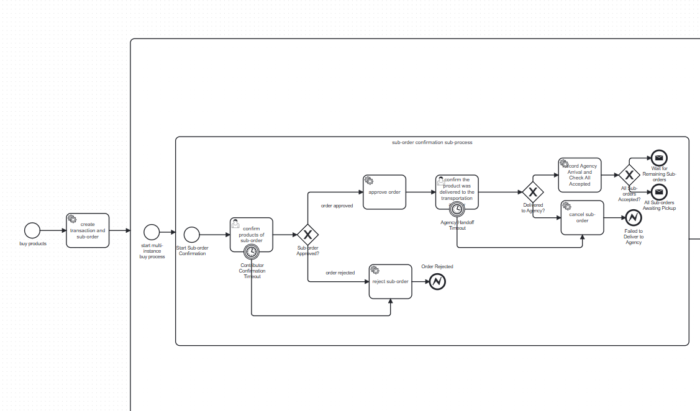](docs/workflows/sub-order-confirmation.png)

#### Product snapshot delivery, review, and return handling

[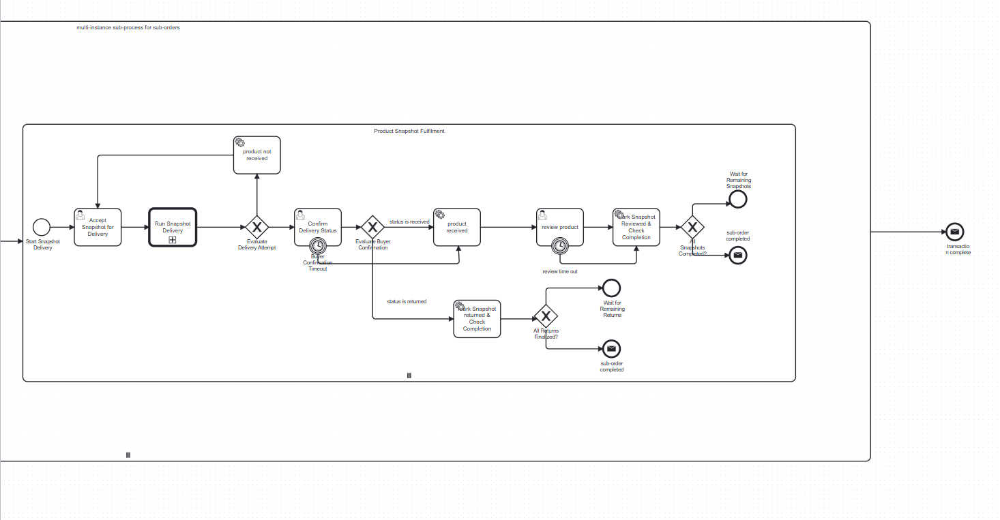](docs/workflows/snapshot-fulfillment.png)

</details>

### Process flow

1. **Create the order.** Checkout creates one transaction, groups selected cart items into shop-specific sub-orders, and records the product and voucher snapshots used for the purchase.
2. **Confirm sub-orders in parallel.** Camunda starts one confirmation subprocess per sub-order. Each contributor accepts or rejects the products belonging to their shop.
3. **Hand accepted parcels to the agency.** An accepted contributor prepares the parcel and confirms its arrival at the transportation agency. Early parcels enter `WAITING_FOR_CONSOLIDATION`; when every accepted shop parcel has arrived, all of them advance to `AWAITING_PICKUP`.
4. **Fulfil snapshots in parallel.** Every product snapshot becomes an independent unit of work. A member of the `SHIPPER` candidate group accepts the work and runs the delivery subprocess.
5. **Evaluate delivery.** Successful delivery waits for buyer confirmation. An unsuccessful attempt returns to shipper assignment while the retry count is below three.
6. **Confirm, review, or return.** A received item proceeds to its review task; a returned item enters the return-completion branch. Review and return completion checks wait for sibling snapshots when necessary.
7. **Close the hierarchy.** A sub-order completes only after all its snapshots reach a final state. The parent transaction completes only after every sub-order instance has finished.

### Workflow controls

| Control | Result |
| --- | --- |
| Contributor confirmation timeout | After five minutes, the sub-order is rejected and the interrupting error path rejects the transaction. |
| Agency handoff timeout or failure | After five minutes, the affected sub-order and parent transaction are cancelled. |
| Buyer confirmation timeout | Delivery is treated as received so an abandoned confirmation task does not block the workflow forever. |
| Delivery not received | The snapshot loops back for another delivery attempt while `retry < 3`; exhaustion moves it to the return/finalization path. |
| Review timeout | The workflow records the review stage as finished and continues its completion check. |
| User cancellation | An interrupting message boundary event cancels the running transaction and its remaining sub-orders. |
| Any sub-order rejection | An interrupting error boundary event rejects the parent transaction consistently across services. |

[Back to workflow navigator](#workflow-navigator) · [Back to top](#morrow-market--full-stack-marketplace)

### Delivery procedure

The shared `delivery-process.bpmn` subprocess handles both outbound purchases and inbound returns. It records one physical delivery attempt and returns a result to whichever parent process called it.

<details open>
<summary><strong>Delivery procedure diagram</strong></summary>

[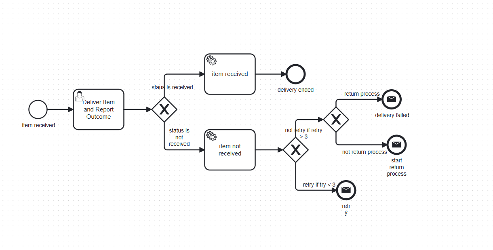](docs/workflows/delivery-procedure.png)

</details>

1. The assigned shipper performs **Deliver Item and Report Outcome** and reports `RECEIVED` or `NOT_RECEIVED`.
2. `RECEIVED` records the successful handoff and ends the delivery subprocess.
3. `NOT_RECEIVED` records the failed attempt and increments the shared retry counter.
4. While `retry < 3`, the subprocess emits a retry outcome so the parent can offer the snapshot to a shipper again.
5. At the retry limit, a normal outbound delivery starts the return process; a delivery already running in return mode reports permanent delivery failure instead of recursively starting another return.

[Back to workflow navigator](#workflow-navigator) · [Back to top](#morrow-market--full-stack-marketplace)

### Return procedure

The `returning-items.bpmn` process transports a customer return back to its contributor and reuses the same delivery subprocess in return mode.

<details open>
<summary><strong>Return procedure diagram</strong></summary>

[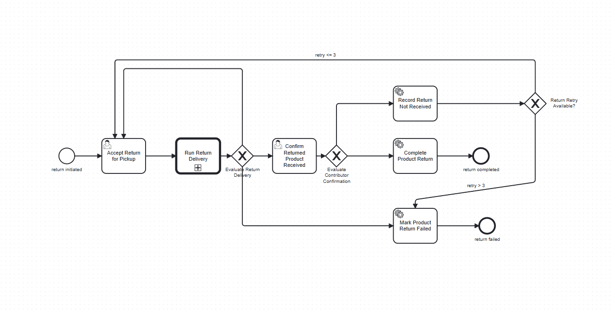](docs/workflows/return-procedure.png)

</details>

1. A member of the `SHIPPER` candidate group accepts the returned snapshot for pickup.
2. **Run Return Delivery** calls the shared delivery procedure with return context and the selected shipper.
3. A delivered return waits for the contributor to confirm that the physical product arrived.
4. Contributor confirmation completes the return and restores stock idempotently.
5. If the contributor reports that the return was not received, the workflow records the failure and loops back to pickup while `retry < 3`.
6. An exhausted retry count or permanent delivery failure marks the product return as failed and closes the process without another delivery loop.

[Back to workflow navigator](#workflow-navigator) · [Back to top](#morrow-market--full-stack-marketplace)

## Services

| Module | Port | Responsibility | Data/integration |
| --- | ---: | --- | --- |
| `api-gateway` | 8000 | Routes API traffic and validates access tokens | Spring Cloud Gateway |
| `auth-service` | 8084 | Registration, login, callbacks, tokens, roles, permissions, and account administration | PostgreSQL, Keycloak |
| `user-service` | 8081 | Account and contributor profiles | PostgreSQL |
| `report-service` | 8082 | Account and product reporting/export | PostgreSQL, JasperReports |
| `ticket-service` | 8083 | Promotions, shipper applications, fulfillment, delivery, and return orchestration | PostgreSQL, Camunda 7 |
| `product-service` | 8085 | Products, shops, carts, orders, reviews, vouchers, and transaction state | MongoDB, Google Cloud Storage |

## Technology

### Frontend

- Angular 21 with standalone components, lazy-loaded routes, route guards, and role-specific layouts
- TypeScript 5.9, RxJS 7, Tailwind CSS 4, and custom global styles
- Zod runtime validation, `ngx-toastr` notifications, and typed API services
- Vitest through the Angular unit-test builder and npm 11 tooling

### Backend

- Java 21, Spring Boot, Spring Security, Spring Cloud Gateway, and WebClient
- OAuth 2.0 resource servers, JWT, and Keycloak 26
- Camunda Platform 7 and executable BPMN workflows
- MapStruct, Lombok, JasperReports, Flyway, and Maven Wrapper

### Data and infrastructure

- PostgreSQL 18 with a separate database for each relational service
- MongoDB 8 configured as a single-node replica set for marketplace transactions
- Google Cloud Storage for product images
- Docker and Docker Compose for the complete local backend stack

## Getting started

### Prerequisites

- Docker Desktop or another Docker Engine with Compose v2
- A Node.js version supported by Angular 21 and npm
- A Google Cloud Storage bucket and service-account key if product image upload is required
- Git

Java 21 is only required when running backend services directly instead of through Docker.

### Clone both repositories

```bash
git clone https://github.com/duynpce/ecommerce-BE.git
git clone https://github.com/duynpce/ecommerce-FE.git
```

### Run the complete backend

```bash
cd ecommerce-BE
docker compose up --build
```

The product service expects a Google Cloud service-account JSON file at:

```text
product-service/src/main/resources/internship-img-storage-597843ff6229.json
```

Use your own credential file, keep it out of Git, and update `GCP_BUCKET_NAME` or the volume mapping in `docker-compose.yml` when needed.

Once the containers are healthy, the main entry points are:

| Entry point | URL |
| --- | --- |
| API gateway | `http://localhost:8000` |
| Keycloak | `http://localhost:9090` |
| Frontend | `http://localhost:4200` |

The credentials and secrets in `docker-compose.yml` are development defaults. Replace them through environment-specific configuration before deploying outside a local environment.

To stop the stack:

```bash
docker compose down
```

### Run the frontend

In another terminal:

```bash
cd ecommerce-FE
npm ci
npm start
```

The development client runs at `http://localhost:4200` and sends relative API requests to `http://localhost:8000/api`. Its Keycloak login flow uses `http://localhost:9090`. Development endpoints live in `src/environments/environment.development.ts`; update `src/environments/environment.ts` before a production build.

## Run tests

### Backend

Each backend module includes its own Maven Wrapper. From a service directory, run:

```bash
./mvnw test
```

On Windows PowerShell:

```powershell
.\mvnw.cmd test
```

Repeat for `api-gateway`, `auth-service`, `user-service`, `report-service`, `ticket-service`, and `product-service`. Integration tests that use Testcontainers require Docker.

### Frontend

From `ecommerce-FE`:

```bash
npm run build
npm test -- --watch=false
```

## Project layout

```text
ecommerce-BE/
├── api-gateway/       # Edge routing and token validation
├── auth-service/      # Authentication and authorization
├── user-service/      # User and contributor profiles
├── report-service/    # Reporting and exports
├── ticket-service/    # BPMN-driven business workflows
├── product-service/   # Marketplace and order domain
├── custom-keycloak/   # Custom Keycloak provider artifacts
├── resource/          # Database bootstrap scripts
└── docker-compose.yml # Local backend orchestration

ecommerce-FE/
└── src/
    ├── app/            # Routes and application configuration
    ├── core/           # Guards and HTTP interceptors
    ├── environments/   # API and Keycloak endpoints
    ├── feat/           # Auth, user, contributor, shipper, admin, and vouchers
    ├── layout/         # Role-specific application shells
    └── shared/         # Reusable components and typed API services
```

## Project demo

Use the links below as a visual tour. Each section can be collapsed, and every screenshot can be clicked to open its full-resolution version.

<p align="center">
  <a href="#shopper-journey">Shopper journey</a> ·
  <a href="#contributor-workspace">Contributor workspace</a> ·
  <a href="https://www.youtube.com/watch?v=GtsnXQDmWhY">Video walkthrough</a>
</p>

<a id="shopper-journey"></a>
<details open>
<summary><strong>🛍️ Shopper journey — home, discovery, cart, checkout, and tracking</strong></summary>

#### Marketplace home

[](docs/screenshots/landing-page.png)

#### Product discovery

[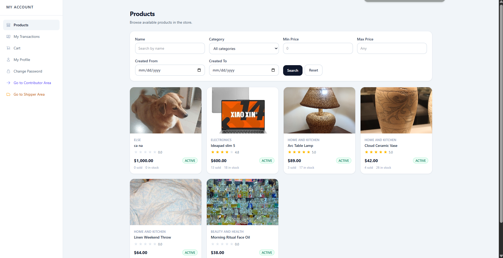](docs/screenshots/product-catalog.png)

#### Cart

[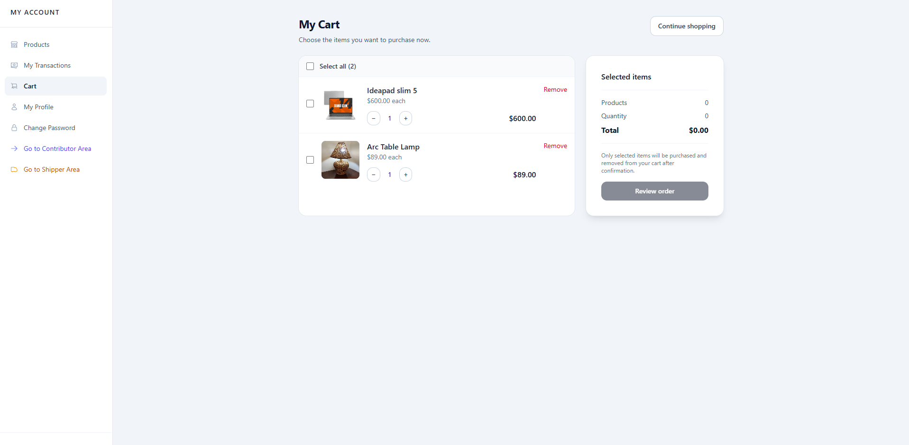](docs/screenshots/shopping-cart.png)

#### Voucher-aware checkout

[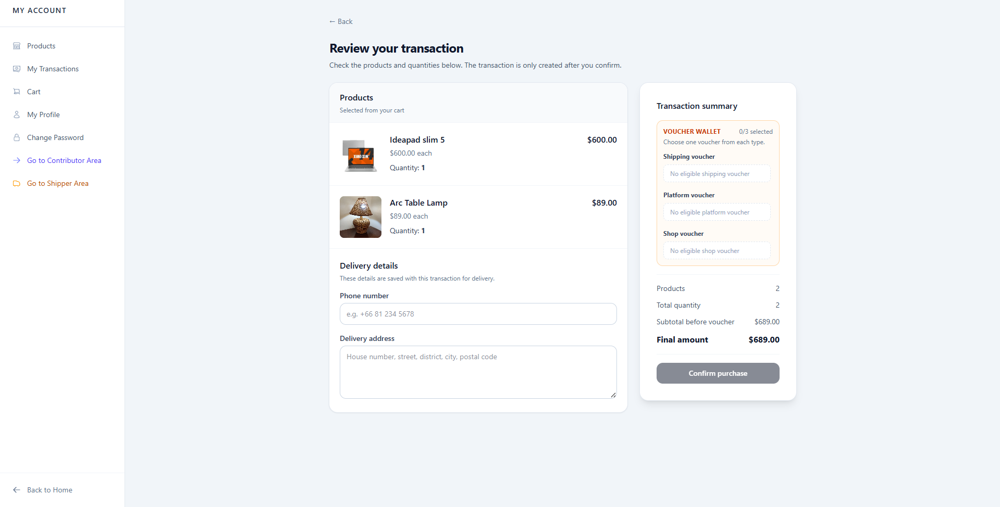](docs/screenshots/checkout-vouchers.png)

#### Transaction tracking and returns

[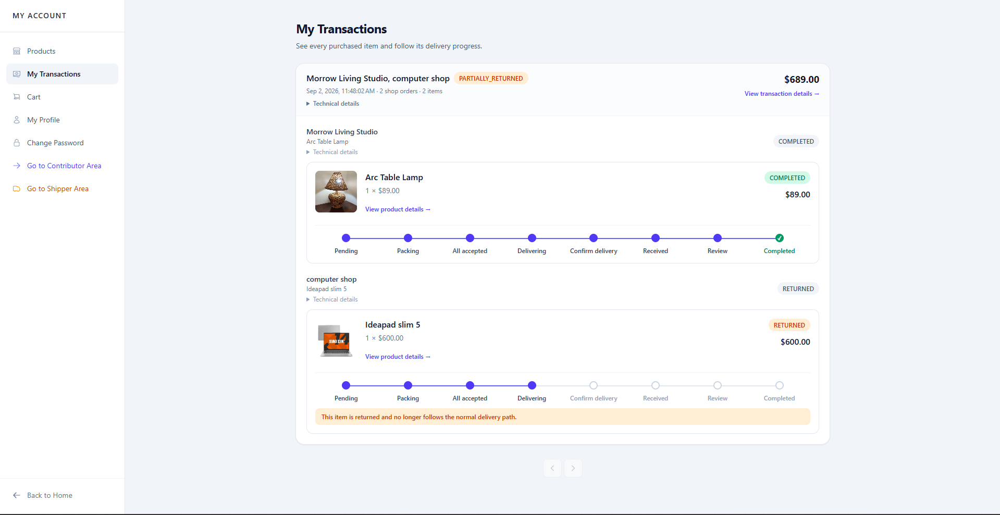](docs/screenshots/transaction-tracking.png)

</details>

<a id="contributor-workspace"></a>
<details open>
<summary><strong>🏪 Contributor workspace — shops and fulfillment</strong></summary>

#### Shop management

[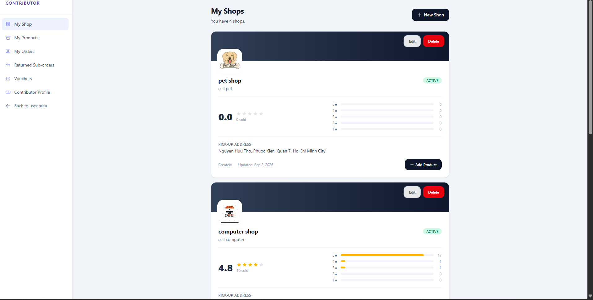](docs/screenshots/contributor-shops.png)

#### Sub-order management

[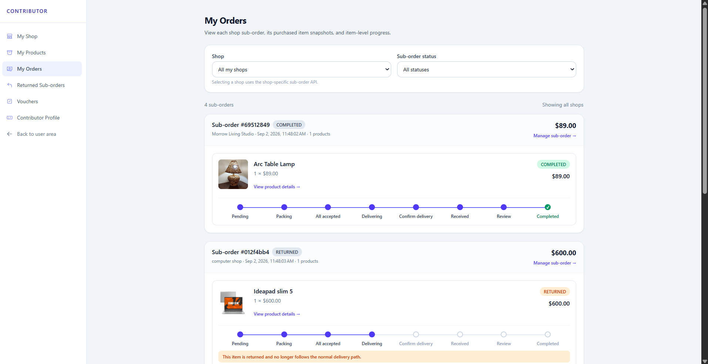](docs/screenshots/contributor-orders.png)

</details>

[Back to navigation](#navigation) · [Watch the full video demo](https://www.youtube.com/watch?v=GtsnXQDmWhY)

## Repositories

| Repository | Contents |
| --- | --- |
| [duynpce/ecommerce-BE](https://github.com/duynpce/ecommerce-BE) | API gateway, domain services, workflow engine, databases, identity integration, and local infrastructure |
| [duynpce/ecommerce-FE](https://github.com/duynpce/ecommerce-FE) | Angular client and the shopper, contributor, shipper, and administrator interfaces |

## License

The backend repository is licensed under Apache License 2.0. The frontend repository is licensed under the MIT License. See the `LICENSE` file in each repository for its terms.
